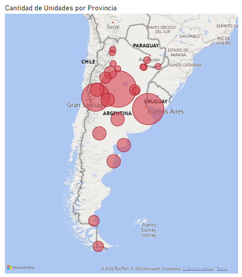
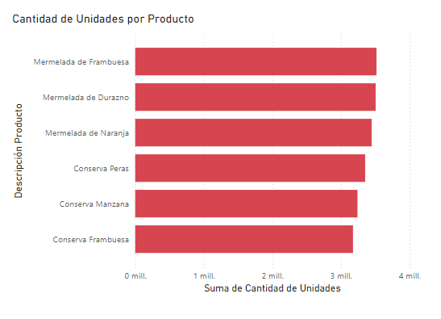

# Proyecto de Análisis en Power BI: Optimización Logística para Empresa de Conservas de Frutas

Este proyecto tiene como propósito ayudar a una empresa de conservas de frutas ubicada en **Río Negro, Argentina**, a tomar decisiones estratégicas basadas en datos para la ubicación de un nuevo **centro de distribución**.

## 🎯 Objetivos del Proyecto

1. **Ubicación estratégica del centro de distribución**:
   - Identificar la provincia óptima para centralizar las operaciones logísticas, considerando los niveles de consumo en todo el país.

2. **Identificación de patrones clave de ventas**:
   - Determinar el producto con mayor volumen de ventas en unidades.
   - Analizar el mes en el que se registraron las mayores ventas.

3. **Diseño de un Dashboard profesional**:
   - Crear visualizaciones dinámicas y atractivas en Power BI, utilizando tonos **rojos** que reflejen la identidad de marca de la empresa.

---

## 📂 Estructura de los Datos

### **1. Archivo: `ventas.csv`**
Contiene los datos transaccionales con las siguientes columnas:
- **Cod_Prov**: Código de la provincia en la que se realizó la venta.
- **Mes**: Mes en que se registró la venta.
- **Cantidad de Producto**: Número de unidades vendidas.
- **Producto**: Código de los productos.

### **2. Archivo: `Tablas+Auxiliares.xlsx`**
Incluye tres hojas con datos de referencia:

#### **Hoja 1: Datos Geográficos**
- **Cod_Prov**: Código de la provincia.
- **Provincia**: Nombre de la provincia.
- **Capital_Prov**: Capital de la provincia.

#### **Hoja 2: Tabla Capitales**
- **Capital**: Nombre de la capital provincial.
- **Latitud**: Coordenada de latitud de la capital.
- **Longitud**: Coordenada de longitud de la capital.

#### **Hoja 3: Productos**
- **Código Producto**: Identificador único del producto.
- **Descripción Producto**: Nombre del producto.
- **Presentación**: Tipo de envase (Frasco o Lata).
- **Volumen (cc)**: Tamaño del envase en centímetros cúbicos.
- **Columna 1**: Información vacía.

---

## 🔍 Metodología de Análisis

### **Paso 1: Importación de Datos**
- Los datos de `ventas.csv` y las hojas de `Tablas+Auxiliares.xlsx` se cargaron en Power BI.
- Se eliminaron las filas vacías y la columna innecesaria (Columna 1).
- Se cambiaron los tipos de datos para asegurar que los datos estuvieran correctamente alineados.
- Se crearon relaciones entre las tablas utilizando la columna **Cod_Prov** como clave primaria.
- Se crearon relaciones entre las tablas utilizando:
  - **Capital** con **Capital_Prov** (relación 1 a 1).
  - **Código Producto** con **Producto** (relación 1 a 1).

### **Paso 2: Exploración de Datos**
- **Análisis geográfico**: Uso de los datos de latitud y longitud para mapear las provincias y sus capitales.
- **Patrones de consumo**: Identificación de las provincias con mayores volúmenes de ventas.

### **Paso 3: Visualizaciones**
- Gráficos dinámicos para mostrar las ventas por provincia, producto y mes.
- Mapas geográficos que destacan las zonas con mayor consumo.
- Indicadores clave para resaltar el producto más vendido y el mes con más actividad.

### **Paso 4: Recomendación Estratégica**
- Determinación de la ubicación más eficiente para el nuevo centro de distribución basado en el consumo regional.

---

## 📊 Resultados y Hallazgos

1. **Ubicación del Centro de Distribución**:
   - Se recomienda instalar el centro de distribución en una de las siguientes provincias con mayor volumen de ventas:
     1. Córdoba
     2. Buenos Aires
     3. Mendoza
   - Esto optimiza los costos y tiempos de entrega.

2. **Producto con Mayor Ventas**:
   - Se identificó que el producto con mayor demanda fue la Mermelada de Frambuesa, lo que facilita una estrategia de abastecimiento más precisa.

3. **Mes con Mayores Ventas**:
   - El análisis mostró que Diciembre fue el mes con el mayor volumen de ventas, lo que puede ayudar a planificar campañas logísticas y de marketing estacional.

---

## 🎨 Diseño del Dashboard

- **Paleta de Colores**: Aplicación de tonos **rojos** en gráficos y visualizaciones para alinearse con la identidad de marca.
- **Elementos Clave del Dashboard**:
  - Gráfico de barras: Ventas por provincia y producto.
  - Mapa geográfico: Concentración de ventas por región.
  - Indicadores visuales: Producto y mes más destacados.

---

## 🛠️ Herramientas Utilizadas

- **Power BI**: Para modelado, análisis y diseño de visualizaciones.
- **Excel**: Para revisión y estructuración inicial de los datos.

---
